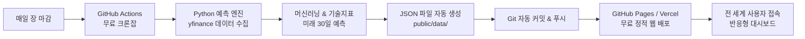

# 📈 ALPHA-PREDICT AI : 100% 무료(0원) 주식 예측 웹 서비스

> **서버 비용 0원, 데이터 비용 0원, 호스팅 비용 0원!**  
> 인공지능 시계열 머신러닝 모델과 기술적 분석 지표를 결합하여 국내 대표 우량주(코스피/코스닥) 및 미국 빅테크 종목의 미래 주가 경로와 투자 매력도 스코어를 분석하고 시각화하는 완전 자동화 웹 서비스입니다.

---

## 🌟 핵심 특징

1. **💡 100% 완전 무료(0원) 운영**
   - **데이터 수집**: Yahoo Finance 무료 오픈 데이터 (`yfinance`)
   - **예측 파이프라인**: Python Scikit-Learn 시계열 앙상블 & 기술적 지표 알고리즘
   - **자동 업데이트**: GitHub Actions 무료 크론 스케줄러 (매일 장 마감 후 자동 실행)
   - **웹 호스팅**: GitHub Pages 또는 Vercel 무료 정적 호스팅

2. **🤖 AI 다면 평가 및 미래 예측 엔진**
   - **미래 30일 가격 경로 예측**: 90% 신뢰구간(상한/하한 밴드) 및 예상가 제시
   - **AI 투자 매력도 스코어 (0~100점)**: 추세(25점) + 모멘텀(25점) + 지지/저항(25점) + 수급(25점)
   - **5단계 매매 시그널**: 강력 매수 / 매수 우세 / 중립·관망 / 매도 유의 / 적극 매도
   - **백테스팅 검증**: 과거 시점 7일 후 예측 적중률 시뮬레이션

3. **📊 프리미엄 인터랙티브 금융 대시보드**
   - 세련된 다크 글래스모피즘(Glassmorphism) 테마 & 네온 하이라이트
   - 순수 Canvas 2D 기반 초경량/초고속 캔들스틱 & 미래 예측 구름대 차트
   - 이동평균선(5/20/60/120일), 볼린저 밴드, RSI, MACD, 거래량 지표 지원
   - 종목 실시간 검색 및 관심 종목(★) 로컬스토리지 영구 저장

---

## 🏗️ 시스템 아키텍처



---

## 🚀 0원으로 실제 배포하는 방법 (3단계)

### 1단계: GitHub에 저장소 만들기
1. [GitHub](https://github.com)에 로그인 후 새 저장소(New repository)를 생성합니다. (예: `stock-predictor`)
2. 저장소는 **Public**으로 생성합니다.

### 2단계: 로컬 코드를 GitHub에 업로드
이 폴더(`주식예측프로그램`)의 터미널(PowerShell)에서 아래 명령어를 순서대로 실행합니다:

```bash
# 1. Git 저장소 초기화
git init

# 2. 파일 추가 및 첫 커밋
git add .
git commit -m "🎉 Initial commit: 0원 AI 주식 예측 웹 서비스"

# 3. 브랜치명을 main으로 설정
git branch -M main

# 4. 본인의 깃허브 저장소 주소 연결 (본인의 GitHub 주소로 변경하세요)
git remote add origin https://github.com/사용자아이디/stock-predictor.git

# 5. 깃허브로 업로드
git push -u origin main
```

### 3단계: GitHub Pages로 무료 웹사이트 배포 (클릭 3번)
1. GitHub 저장소 페이지의 상단 **[Settings]** 탭으로 이동합니다.
2. 좌측 메뉴에서 **[Pages]**를 클릭합니다.
3. **Build and deployment** 섹션의 Source를 **Deploy from a branch**로 선택합니다.
4. Branch를 **`main`**, 폴더를 **`/public`**으로 선택하고 **[Save]** 버튼을 클릭합니다.
5. 약 1~2분 후 상단에 발급된 **무료 웹사이트 주소**(`https://사용자아이디.github.io/stock-predictor/`)가 표시되며, 전 세계 누구나 접속할 수 있습니다!

> **✨ Vercel로 더 빠른 배포를 원할 경우 (대안):**
> 1. [Vercel](https://vercel.com) 회원가입 (GitHub 계정으로 1초 로그인)
> 2. **Add New Project** 클릭 후 GitHub 저장소(`stock-predictor`) 선택
> 3. Root Directory를 `public`으로 설정 후 **Deploy** 클릭 시 즉시 무료 도메인 발급!

---

## ⏰ 매일 자동 업데이트 설정 확인

`.github/workflows/daily_update.yml` 파일이 저장소에 업로드되면, **GitHub Actions**가 매일 자동으로 최신 주가를 분석하고 사이트를 업데이트합니다.

- **GitHub 저장소의 [Actions] 탭**에서 매일 실행되는 로그를 확인할 수 있습니다.
- 언제든 **[Run workflow]** 버튼을 눌러 지금 즉시 강제로 주가 분석을 갱신할 수도 있습니다.
- **필수 권한 설정**: GitHub 저장소의 `Settings` > `Actions` > `General` > `Workflow permissions`에서 **"Read and write permissions"**를 선택하고 저장하세요.

---

## 💻 로컬에서 직접 실행하기

컴퓨터에서 바로 실행해보고 싶을 때:

```bash
# 1. 최신 주가 수집 및 AI 예측 실행
python backend/runner.py

# 2. 로컬 웹 서버 실행
python -m http.server 8088 --directory public
```
브라우저에서 `http://localhost:8088`에 접속하면 대시보드가 표시됩니다.

---

## 📁 프로젝트 구조

```
주식예측프로그램/
├── .github/
│   └── workflows/
│       └── daily_update.yml      # GitHub Actions 매일 자동 실행 크론
├── backend/
│   ├── collector.py              # 주가 데이터 수집기 (yfinance)
│   ├── indicators.py             # 기술적 보조지표 계산 (RSI, MACD, BB 등)
│   ├── predictor.py              # AI 시계열 예측 모델 & 다각도 스코어링
│   ├── runner.py                 # 전체 파이프라인 실행 및 JSON 빌드
│   └── requirements.txt          # Python 필수 패키지 목록
├── public/                       # 정적 웹 호스팅 루트
│   ├── index.html                # 반응형 웹 대시보드 메인
│   ├── css/
│   │   └── style.css             # 모던 다크 글래스모피즘 스타일
│   ├── js/
│   │   ├── app.js                # UI 상태 관리 및 데이터 바인딩
│   │   └── chart_engine.js       # 초고속 캔버스 캔들스틱/예측 차트 엔진
│   └── data/
│       ├── stocks.json           # 지원 종목 메타데이터
│       ├── latest_summary.json   # 전체 종목 종합 요약
│       └── predictions/          # 종목별 1년치 캔들 & 미래 30일 예측 JSON
├── .gitignore
└── README.md
```

---

## ⚠️ 면책 조항 (Disclaimer)

본 프로그램이 제공하는 주가 예측 및 AI 투자 스코어는 통계적 머신러닝 알고리즘 및 기술적 지표에 기반한 데이터 분석 결과이며, 미래의 수익을 보장하지 않습니다. 모든 투자의 최종 결정과 책임은 투자자 본인에게 있습니다.
